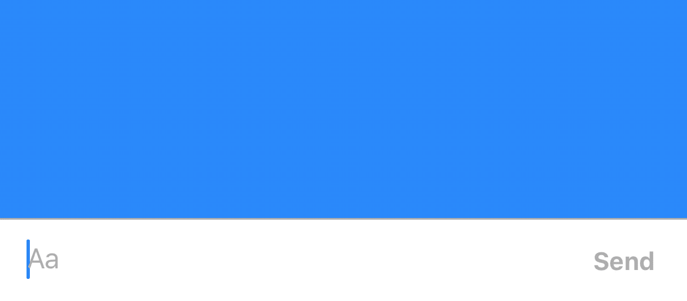

[]()

# InputBarAccessoryView

### Features

- [x] Autocomplete text with @mention, #hashtag or any other prefix 
- [x] A self-sizing `UITextView` with an optional fixed height (can be replaced with any other view)
- [x] Image paste support   
- [x] Autocomplete attributed text highlighting
- [x] Reactive components that respond to given events
- [x] Top/Bottom/Left/Right `InputStackView`s that act as toolbars to place buttons
- [x] Drop in attachment view for file/photo management
- [x] Plugin support for your own `InputPlugin`s
- [x] Compatible with all iPhones and iPads
- [x] RTL Support

### Installation via Swift Package Manager (SPM)

The [Swift Package Manager](https://swift.org/package-manager/) is a tool for automating the distribution of Swift code and is integrated into the `swift` compiler.
Once you have your Swift package set up, adding InputBarAccessoryView as a dependency is as easy as adding it to the dependencies value of your Package.swift.

```
dependencies: [
    .package(url: "https://github.com/nathantannar4/InputBarAccessoryView.git", .upToNextMajor(from: "6.0.0"))
]
```
You can also add it via Xcode SPM editor with URL:
```
https://github.com/nathantannar4/InputBarAccessoryView.git
```

### Requirements

iOS 13.0+
Swift 5.5

> The latest iOS 12 release is v5.5.0

> CocoaPods and RxExtensions were removed in 6.0.0

> The latest iOS 11 release is v5.1.0

> The latest Swift 5.0 release is v5.1.0 

> The latest Swift 4.2 release is v4.2.2 

### Documentation

[Getting Started](./GETTING_STARTED.md)

> See the Example project to see how you can make the iMessage, Slack, Facebook and GitHawk input bars!

### Example Usage

     

### Featured In

Add your app to the list of apps using this library and make a pull request.

- [MessageKit](https://github.com/MessageKit/MessageKit) *(renamed to MessageInputBar)*
<p>
  
</p>

- [MessageViewController](https://github.com/GitHawkApp/MessageViewController) *(Autocomplete Highlighting Algorithm)*
<p>
  
</p>

### See Also

iMessage style [TypingIndicator](https://github.com/nathantannar4/TypingIndicator) for chat apps

## Latest Releases
6.2.0
   - Remove `canBecomeFirstResponder` on `InputTextView` to fix `UITextViewDelegate` methods not being called
   
6.1.1
   - Fixed warning for Xcode 14

6.1.0
   - #230 Added additionalInputViewBottomConstraintConstant to KeyboardManager as a way for providing additional bottom constraint constant offset for inputAccessoryView. Example implementation can be found in AdditionalBottomSpaceExampleViewController

6.0.0
   - **Breaking change**: Drop iOS 12 support
   - **Breaking change**: Drop CocoaPods support & RxSwift extension (it was available only via CocoaPods)
   - KeyboardManager will not update position of inputAccessoryView from interactive dismiss panGesture when the keyboard is floating
   - Update docs

5.5.0
   - Update SPM tools to Swift 5.5
   - Added new optional delegate method for custom attachments size
   - Added new animations for left/right stack view constraints

5.4.0
   - Make sure framework is ready for Xcode 13
   - Fix availability in AppExtensions
   - Fix Package.swift to support iOS 12+ only
    
See [CHANGELOG](./CHANGELOG.md) for more details and older releases.

**Find a bug? Open an issue!**

## Layout

The layout of the `InputBarAccessoryView` is made of of 4  `InputStackView`'s and an `InputTextView`. The padding of the subviews can be easily adjusted by changing the `padding` and `textViewPadding` properties. The constraints will automatically be updated.


It is important to note that each of the `InputStackView `'s to the left and right of the `InputTextView` are anchored by a width constraint. This way the `InputTextView` will always fill the space inbetween in addition to providing methods that can easily be called to hide all buttons to the right or left of the `InputTextView` by setting the width constraint constant to 0. The bottom and top stack views are not height constraint and rely on their `intrinsicContentSize`

```swift
func setLeftStackViewWidthConstant(to newValue: CGFloat, animated: Bool)

func setRightStackViewWidthConstant(to newValue: CGFloat, animated: Bool)
```

### Reactive Hooks

Each `InputBarButtonItem` has properties that can hold actions that will be executed during various hooks such as the button being touched, the `UITextView `text changing and more! Thanks to these easy hooks with a few lines of code the items can be easily resized and animated similar to that of the Facebook messenger app.

```swift
// MARK: - Hooks
    
public typealias InputBarButtonItemAction = ((InputBarButtonItem) -> Void)    
    
private var onTouchUpInsideAction: InputBarButtonItemAction?
private var onKeyboardEditingBeginsAction: InputBarButtonItemAction?
private var onKeyboardEditingEndsAction: InputBarButtonItemAction?
private var onKeyboardSwipeGestureAction: ((InputBarButtonItem, UISwipeGestureRecognizer) -> Void)?
private var onTextViewDidChangeAction: ((InputBarButtonItem, InputTextView) -> Void)?
private var onSelectedAction: InputBarButtonItemAction?
private var onDeselectedAction: InputBarButtonItemAction?
private var onEnabledAction: InputBarButtonItemAction?
private var onDisabledAction: InputBarButtonItemAction?
```

## Author
<p>
	
</p>

**Nathan Tannar** - [https://nathantannar.me](https://nathantannar.me)
**Jakub Kaspar** - [https://jakubkaspar.dev](https://jakubkaspar.dev)

## License

Distributed under the MIT license. See ``LICENSE`` for more information.
